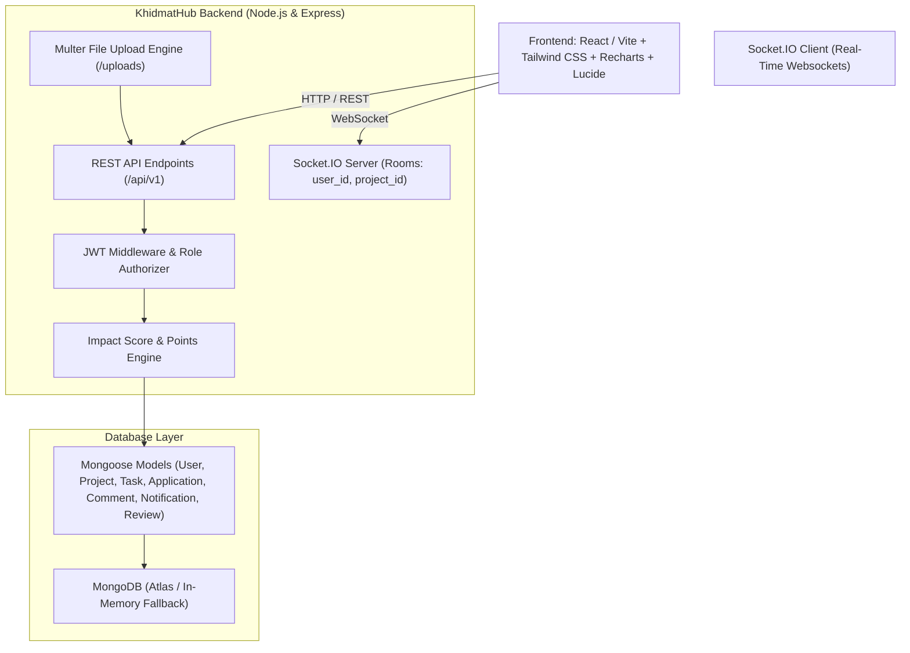

# 🌟 KhidmatHub (formerly ImpactHub) — Saylani Community Impact Platform

<div align="center">

[](https://github.com)
[](https://github.com)
[](https://github.com)
[](https://github.com)
[](LICENSE)

<p align="center">
  <strong>A comprehensive full-stack ecosystem uniting students, project managers, and administrators to launch, manage, and scale community welfare & environmental initiatives across Pakistan.</strong>
</p>

[Explore Features](#-core-features) • [Quick Start](#-quick-start) • [Demo Credentials](#-instant-1-click-demo-logins) • [Impact Formula](#-impact-score-algorithm) • [API Docs](#-api-endpoints-reference)

</div>

---

## 💡 About The Project

**KhidmatHub** (خدمت ہب — *The Center of Community Service*) is built for the **Saylani Community Impact Platform Hackathon Challenge**. 

It addresses the fundamental challenge of coordinating large-scale volunteerism by bridging:
1. **Project Management Systems** (Kanban boards, task assignments, priorities, deadlines, evidence uploads)
2. **Volunteer Recruitment Platforms** (Skill-based discovery, motivation screening, anti-duplicate application guards)
3. **Social & Community Hubs** (Real-time threaded discussions, peer ratings, 1–5 star reviews)
4. **Gamified Points & Leaderboards** (Activity points engine, dynamic badges, national contributor podium)
5. **Real-time Notification Centers** (Socket.IO alerts, dropdown badges, floating toasts)
6. **Executive Admin Dashboards** (Recharts analytics, user moderation, campaign approval queues)

---

## 🏆 Project Name Options

If you would like to customize the branding for your GitHub repository or submission pitch:

| Name | Meaning & Brand Positioning |
| :--- | :--- |
| **🥇 KhidmatHub** *(Recommended)* | *Khidmat* (خدمت — selfless community service) + modern tech hub. Culturally authentic and deeply aligned with Saylani Welfare's mission. |
| **🥈 ImpactVerse** | Modern, expansive vision representing a universe of social impact and youth-driven community transformation. |
| **🥉 ImpactSync** | Emphasizes the real-time Socket.IO collaboration and synchronization between volunteers, tasks, and managers. |
| **⭐ UmeedPulse** | *Umeed* (امید — hope) + real-time community pulse. Inspiring and memorable for social good initiatives. |
| **⭐ Saylani ImpactSphere** | 360-degree governance and volunteer mobilization platform. |

---

## 🚀 Core Features Matrix

### 👥 1. Multi-Role Authorization & Security
- **3 Distinct Roles**: `student` (volunteer), `manager` (project lead), and `admin` (super-admin).
- **Security**: JWT authentication, bcrypt password hashing, HTTP-only/Bearer token guards, and role-based route protection (`requireRole('admin')`).
- **One-Click Demo Switcher**: Instant switching between demo student, manager, and admin accounts without manual typing.

### 🔍 2. MongoDB-Powered Project Discovery Engine
- **Full-Text Search**: Live keyword search across title, description, and required skills.
- **Multi-Field Filtering**:
  - **Category**: *Environment, Education, Health, Technology, Emergency Relief, Community Welfare*
  - **Location / City**: *Karachi, Rawalpindi, Lahore, Islamabad, Peshawar, Faisalabad, etc.*
  - **Status**: *Active, Completed, Pending Approval*
- **5 Dynamic Sorting Modes**: `Newest First`, `Highest Impact Score`, `Nearest Deadline`, `Most Volunteers Needed`, `Oldest First`.

### 📋 3. Interactive Kanban Board & Task Evidence
- **3 Responsive Columns**: `TO DO` | `IN PROGRESS` | `COMPLETED`.
- **Task Metadata**: Priority badges (`LOW`, `MEDIUM`, `HIGH`, `URGENT ⚡`), assignee avatars, deadline alerts with countdown.
- **Completion Verification**: Students can upload completion notes and file proof (photos/documents), earning **+20 Volunteer Points** with celebratory confetti.

### 💬 4. Real-Time Discussions & Notifications (Socket.IO)
- **Live Threaded Chat**: Broadcasts updates and replies instantaneously to all active project members.
- **Role Badges**: Highlights Project Leads, Volunteers, and Admins in discussion threads.
- **Live Notifications**: Navbar badge counters, dropdown drawer, and floating toast notifications for approvals, task assignments, and mentions.

### 🌟 5. Mathematical Impact Score & Points Engine
- **Project Impact Score Formula**:
  $$\text{Impact Score} = \big(\text{Volunteers Joined} \times (\text{Tasks Completed} + 1) \times \text{Progress \%}\big) + (\text{Average Rating} \times 100)$$
- **Volunteer Activity Points**:
  - Apply & Join project: **$+10$ pts**
  - Complete an assigned task: **$+20$ pts**
  - Meaningful discussion contribution: **$+5$ pts**
  - Receive 5-star project review: **$+25$ pts**
  - Complete full campaign milestone: **$+100$ pts**
- **Podium Leaderboard**: Real-time rankings with badges (*Impact Pioneer, Active Contributor, Task Master, Community Hero, Legendary Impact Maker*).

### 📊 6. Role Dashboards & Admin Oversight
- **Student Dashboard**: Tasks progress rate, projects joined, contribution hours, application tracker.
- **Manager Dashboard**: Active projects summary, pending volunteer application review drawer with 1-click Approve/Reject.
- **Admin Dashboard**: Visual Recharts (Users by Role, Projects by Category), user moderation table with suspend/activate controls, and pending project approval queue.

---

## ⚡ Instant 1-Click Demo Logins

Pre-configured accounts with realistic Saylani community seed data:

| Role | Demo Email | Password | Pre-loaded Data |
| :--- | :--- | :--- | :--- |
| **🎓 Student / Volunteer** | `student@impacthub.pk` | `password123` | Ali Khan (1,250 pts, Clean Rawalpindi team member, 5 assigned tasks) |
| **📋 Project Manager** | `manager@impacthub.pk` | `password123` | Usman Ghani (Manager of Clean Rawalpindi Campaign & IT Youth Bootcamp) |
| **🛡️ Platform Admin** | `admin@impacthub.pk` | `password123` | Muhammad Tariq (Platform Super-Admin, nationwide oversight) |

---

## 🏗️ System Architecture



---

## 🚀 Quick Start & Installation

### Prerequisites
- **Node.js**: `v18.0.0` or newer
- **npm**: `v9.0.0` or newer

### 1. Clone the Repository
```bash
git clone https://github.com/your-username/khidmathub.git
cd khidmathub
```

### 2. Backend Setup
```bash
cd server
npm install
npm start
```
> [!NOTE]
> If no `MONGODB_URI` is provided in `server/.env`, the server **automatically starts an embedded in-memory MongoDB** and seeds all realistic Saylani campaigns, users, and tasks for zero-friction setup!

### 3. Frontend Setup
In a new terminal window:
```bash
cd client
npm install
npm run dev
```
Open **[http://localhost:5173](http://localhost:5173)** in your browser.

---

## 📡 API Endpoints Reference

### 🔐 Authentication (`/api/v1/auth`)
- `POST /register` — Register a new student or manager (supports avatar upload)
- `POST /login` — Authenticate and receive JWT token
- `POST /demo-login` — 1-click fast login by role (`student`, `manager`, `admin`)
- `GET /me` — Get authenticated user profile with live statistics
- `PUT /profile` — Update user details, bio, skills, and avatar

### 📁 Projects (`/api/v1/projects`)
- `GET /` — Search, filter (category, location, status, skills), and sort projects
- `GET /:id` — Get single project details with populated tasks and team roster
- `POST /` — Create a new project (Manager / Admin, supports image banner upload)
- `PUT /:id` — Update project details and trigger impact score recalculation
- `DELETE /:id` — Delete project and its associated tasks

### 📝 Applications (`/api/v1/applications`)
- `POST /` — Apply to join a project (with anti-duplicate validation)
- `GET /my` — List applications submitted by current student
- `GET /project/:projectId` — List applications for a project (Manager / Admin)
- `PUT /:id/review` — Approve (+10 pts) or reject application with feedback

### ✅ Tasks & Kanban (`/api/v1/tasks`)
- `POST /` — Assign task with priority and deadline (Manager / Admin)
- `GET /project/:projectId` — Get Kanban tasks grouped by status
- `GET /my` — Get tasks assigned to logged-in user
- `PUT /:id/status` — Transition task (`TODO` $\rightarrow$ `IN_PROGRESS` $\rightarrow$ `COMPLETED`), upload proof, and award +20 pts
- `DELETE /:id` — Delete task

### 💬 Discussions & Comments (`/api/v1/discussions`)
- `GET /project/:projectId` — Get threaded comments and replies
- `POST /` — Add comment or reply (awards +5 pts, broadcasts via Socket.IO)
- `DELETE /:id` — Delete own comment or manager delete

### 🔔 Notifications (`/api/v1/notifications`)
- `GET /` — Get user notifications and unread counter
- `PUT /:id/read` — Mark notification as read
- `PUT /read-all` — Mark all notifications as read

### ⭐ Reviews (`/api/v1/reviews`)
- `GET /project/:projectId` — Get project reviews and star ratings
- `POST /` — Submit 1–5 star review (+25 pts for volunteer, updates project rating)

### 🛡️ Admin Suite (`/api/v1/admin`)
- `GET /stats` — Nationwide platform metrics and category aggregations
- `GET /users` — Paginated user management table with role filters and search
- `PUT /users/:id/status` — Suspend or activate user account
- `PUT /users/:id/role` — Update user role (`student`, `manager`, `admin`)
- `PUT /projects/:id/review` — Approve or reject submitted project campaigns

### 🏆 Leaderboard (`/api/v1/leaderboard`)
- `GET /` — Top volunteers ranked by activity points & top projects by impact score

---

## 📂 Repository Structure

```
khidmathub/
├── package.json               # Root scripts
├── README.md                  # Project documentation
├── server/
│   ├── src/
│   │   ├── config/            # DB connection (with in-memory fallback) & Socket.IO
│   │   ├── controllers/       # Business logic (auth, project, task, application, etc.)
│   │   ├── middleware/        # JWT auth, role authorizer, Multer upload, error handler
│   │   ├── models/            # Mongoose schemas (User, Project, Task, Application, etc.)
│   │   ├── routes/            # Express REST route definitions
│   │   ├── seeds/             # Saylani community realistic demo seed data
│   │   └── server.js          # Main server entry point
│   ├── test-api.js            # Automated verification test suite
│   └── package.json
└── client/
    ├── src/
    │   ├── components/
    │   │   ├── layout/        # Navbar, Footer, MobileNav
    │   │   ├── common/        # Badge, ProgressBar, StatsCard, Modal, Toast
    │   │   ├── projects/      # ProjectCard, ProjectFilters, CreateProjectModal, ApplyModal
    │   │   ├── kanban/        # KanbanBoard, TaskModal, EvidenceModal
    │   │   ├── discussion/    # DiscussionThread
    │   │   ├── reviews/       # ReviewsSection
    │   │   └── dashboard/     # StudentDashboard, ManagerDashboard, AdminDashboard
    │   ├── context/           # AuthContext & SocketContext (realtime)
    │   ├── pages/             # Home, Projects, Details, Dashboard, Leaderboard, Admin, Login, Register, Profile
    │   ├── services/          # Axios API client with auth interceptors
    │   ├── App.jsx            # Main app coordinator
    │   ├── index.css          # Tailwind custom theme directives
    │   └── main.jsx
    ├── tailwind.config.js     # Saylani Emerald color theme configuration
    ├── vite.config.js         # Vite configuration with API proxy
    └── package.json
```

---

## 📜 License

Distributed under the **MIT License**. See `LICENSE` for more information.

<div align="center">
  <sub>Built with ❤️ for Saylani Welfare International Trust • Hackathon Challenge 2026</sub>
</div>
